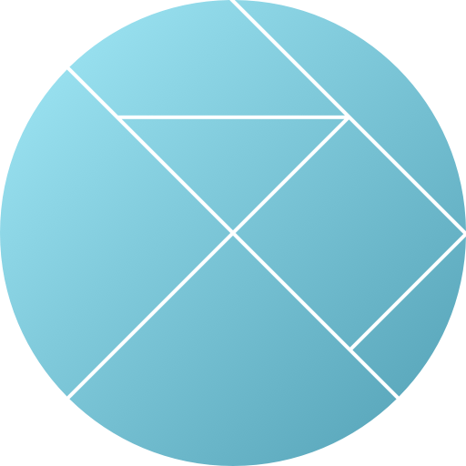

#  elmtrn

elm + typescript + electron boiler plate

[](https://github.com/yasuyuky/elmtrn/actions)

# Requirement

- elm (v 0.19)
- npm

# Quickstart

```
git clone https://github.com/yasuyuky/elmtrn
cd elmtrn
npm install
npm start
```

# License


